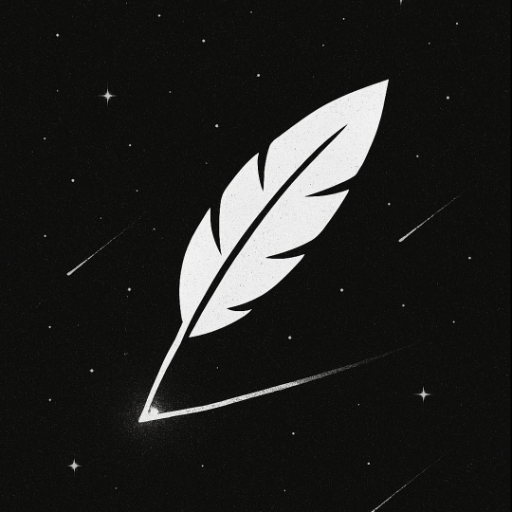
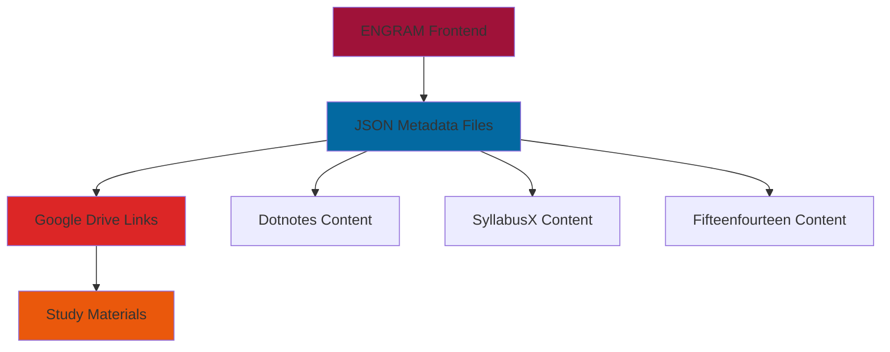
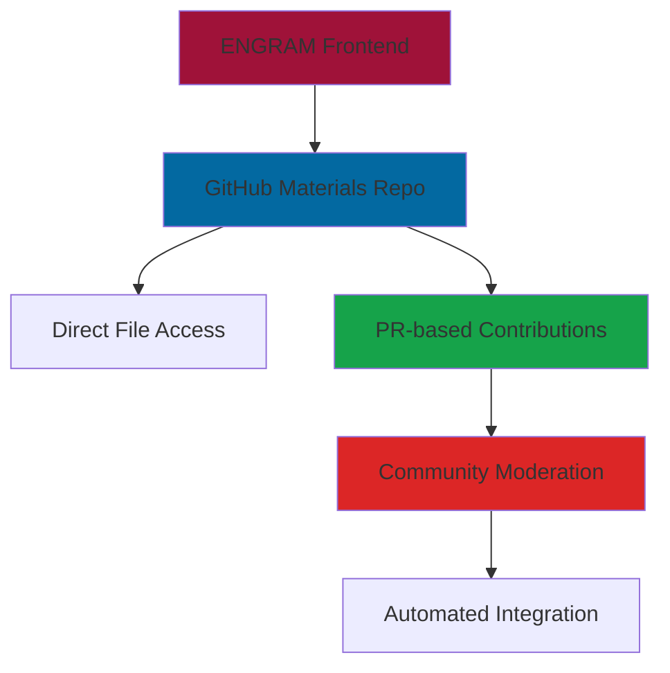
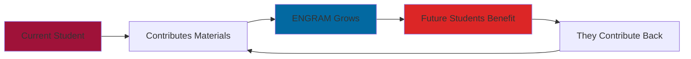

<div align="center">
   
</div>

<h1 align="center">E N G R A M</h1>
<h3 align="center">The Centralized, No BS Open-Source Hub for IP University Study Materials</h3>

<p align="center">
   
   
   
</p>

<div align="center">
   <table>
       <td align="center" width="60%">
         
         <br><em>Desktop Experience</em>
       </td>
       <td align="center" width="40%">
         
         <br><em>Mobile Experience</em>
         </td>
      </tr>
   </table>
</div>

## Project Overview

**ENGRAM** is a modern, open-source web platform designed to centralize all study materials for IP University students across 8 engineering branches and semesters. 

ENGRAM is and will **always stay free to access with no ads and no trackers**. It aims to provide instant access to notes, previous year questions, lab manuals, and comprehensive resources without the typical friction of academic resource hunting or unreliable websites.

**Born from Frustration, Built for (potential) Solutions**

> *"I don't know about you, but during exam prep, I don't like having to open 4 different websites, 2 drive links and 4 WhatsApp groups just to get good material. Sometimes the websites are down, have bad UI and are filled with ads, half the notes are outdated or just confusing. This was me literally two days before our last exam and I honestly had it. That's why I started making ENGRAM."*

## Project Overview

**ENGRAM** is a modern, open-source web platform designed to centralize all study materials for IP University students across 8 engineering branches and semesters. 

ENGRAM is and will **always stay free to access with no ads and no trackers**. It aims to provide instant access to notes, previous year questions,

### **What We Have Now** 
- ✅ **Aggregated Content** - Notes from Dotnotes, SyllabusX, and Fifteenfourteen (with proper credits)
- ✅ **Clean Interface** - Modern, space-themed UI with no ads or trackers
- ✅ **Smart Organization** - Branch and semester-based structure
- ✅ **Google Drive Integration** - Currently using JSON metadata with Google Drive links for 10,000+ materials

### **What's Coming Next**
- 🚧 **Dedicated Materials Repository** - Moving away from Google Drive to a proper GitHub-based system
- 🚧 **Community Upload System** - Easy pull request workflow for material contributions
- 🚧 **Real-time Updates** - Always current materials with community maintenance
- 🚧 **Contributor Recognition** - Your name on every note you upload

> **Note:** We're currently using JSONs with Google Drive links, but we're working toward a dedicated repository for notes. It's challenging to manage 10,000+ notes and we're still not complete, but we're committed to making it happen! The transition will
<td align="center" width="33%">
<br><strong>Scattered Resources</strong><br>
<em>Most notes on present sites are old, new assignments don't get uploaded, and you REALLY have to dig to find quality material.</em>
</td>
<td align="center" width="33%">
<br><strong>Outdated Content</strong><br>
<em>Old notes, old papers, outdated assignments. Without active maintenance, platforms become digital graveyards.</em>
</td>
<td align="center" width="33%">
<br><strong>Poor User Experience</strong><br>
<em>Bad UI, ads everywhere, unreliable websites that go down during exam time when you need them most.</em>
</td>
</tr>
</table>

### **The Sustainability Challenge**

<table>
<tr>
<td align="center" width="33%">
<br><strong>Continuous Updates</strong><br>
<em>Syllabus changes, new subjects emerge, old materials become outdated. Without active maintenance, ENGRAM becomes just another dead repository.</em>
</td>
<td align="center" width="33%">
<br><strong>Content Quality</strong><br>
<em>The best notes come from students who just mastered the subject. Your fresh perspective and recently created materials are invaluable.</em>
</td>
<td align="center" width="33%">
<br><strong>Network Effects</strong><br>
<em>The more students contribute, the better ENGRAM becomes for everyone. We need critical mass to become the go-to resource.</em>
</td>
</tr>
</table>

### **The Vision: A Legacy That Outlives Us**

- 🎯 **The First Stop** - Every IPU student's go-to resource for any subject
- 🏆 **Quality Guaranteed** - Peer-reviewed content that students actually trust
- 🚀 **Always Current** - Real-time updates as syllabi change and new materials emerge
- 🤝 **Student-Led** - Decisions made by and for the community
- 🌟 **Recognition System** - Contributors get credited for every upload
- 🔄 **Self-Sustaining** - A resource that evolves and improves with each batch of students

> *"I want us to create a resource that out-lives us even after graduation, constantly evolves and is a token from us to our future juniors."*

<div align="center">

### **ENGRAM's Solution:**

<table>
<tr>
<td align="center" width="25%">
<br><strong>Centralized Hub</strong><br>
<em>Everything in one place</em>
</td>
<td align="center" width="25%">
<br><strong>Smart Organization</strong><br>
<em>Branch & semester based structure</em>
</td>
<td align="center" width="25%">
<br><strong>Instant Access</strong><br>
<em>No registration, no barriers</em>
</td>
<td align="center" width="25%">
<br><strong>Community Driven</strong><br>
<em>By students, for students</em>
</td>
</tr>
</table>

<div align="center">
<strong>💡 ENGRAM becomes powerful only when WE make it powerful together</strong>
</div>

## Key Features

<table>
<tr>
<td width="50%">

### 🎓 **Academic Coverage**
- **8 Engineering Branches** - AIDS, AIML, CIVIL, CSE, ECE, EEE, IT, MECH
- **8 Semester Range** - Complete undergraduate coverage
- **Comprehensive Resources** - Syllabus, Notes, PYQs, Lab materials, Books
- **Special Collections** - Akash notes and actually decent youtube lectures

</td>
<td width="50%">

### 🌌 **Cosmic User Experience**
- **Space-themed Interface** - Beautiful dark UI with starfield animations
- **Responsive Design** - Works perfectly on mobile, tablet, and desktop
- **Smart Navigation** - Remembers your branch/semester preferences
- **Instant Loading** - Fast, optimized React architecture

</td>
</tr>
<tr>
<td width="50%">

### 📚 **Resource Management**
- **Tabbed Organization** - Clean separation of different material types
- **Contributor Attribution** - Recognition for community contributors
- **Download & Preview** - Both options available for all materials
- **Search Integration** - Quick access to specific subjects

</td>
<td width="50%">

### 🛠️ **Technical Excellence**
- **Modern Stack** - React 18, TypeScript, Vite, Tailwind CSS
- **ShadCN UI** - Premium component library for consistency
- **Local Storage** - Persistent user preferences
- **PWA Ready** - Installable as a progressive web app

</td>
</tr>
</table>
</div>

## Technical Architecture & Implementation

### **Current Technology Stack**
- **Frontend:** React 18 + TypeScript + Vite
- **Styling:** Tailwind CSS + ShadCN UI components
- **Routing:** React Router for seamless navigation
- **State:** Local Storage for user preferences
- **Content:** JSON metadata with Google Drive integration
- **Deployment:** GitHub Pages with custom domain

### **Data Architecture (Current)**


### **Planned Architecture Migration**


## 🚀 Getting Started

### Prerequisites

<table>
<tr>
<td width="50%">

**Development Requirements:**
- Node.js 18+ or Bun (recommended)
- npm, yarn, or bun package manager
- Modern web browser (Chrome, Firefox, Safari, Edge)
- Git for version control

</td>
<td width="50%">

**System Requirements:**
- Any modern OS (Windows, macOS, Linux)
- 4GB+ RAM recommended
- 1GB+ free disk space
- Stable internet connection

</td>
</tr>
</table>

### Quick Installation

```bash
# Clone the repository
git clone https://github.com/kuberwastaken/engram.git
cd engram

# Install dependencies (choose one)
npm install
# or
yarn install
# or (recommended)
bun install

# Start development server
npm run dev
# or
yarn dev
# or (recommended)
bun dev

# Open your browser to http://localhost:5173
```

### 📁 Project Structure

```
├── public/                   # Static assets and materials
│   ├── assets/              # Logo, icons, and branding
│   ├── materials/           # Study materials (temporary)
│   └── Content-Meta/        # Metadata for content organization
├── src/                     # Source code
│   ├── components/          # Reusable UI components
│   │   ├── ui/             # ShadCN UI primitives
│   │   ├── StarField.tsx   # Cosmic background animation
│   │   └── SubjectGrid.tsx # Subject listing component
│   ├── pages/              # Route pages
│   ├── hooks/              # Custom React hooks
│   └── lib/                # Utility functions
├── scripts/                # Data processing and migration scripts
└── package.json           # Dependencies and scripts
```

## 📚 Current Content & Sources

### **Aggregated Content Sources**
ENGRAM currently aggregates materials from multiple trusted sources, with proper attribution:

<table>
<tr>
<td width="33%" align="center">
<br><strong>🔵 Dotnotes</strong><br>
<em>Comprehensive notes across multiple branches</em><br>
<sub>Full credit and attribution maintained</sub>
</td>
<td width="33%" align="center">
<br><strong>📘 SyllabusX</strong><br>
<em>Syllabus and structured course content</em><br>
<sub>Original creators acknowledged</sub>
</td>
<td width="33%" align="center">
<br><strong>📖 Fifteenfourteen</strong><br>
<em>Additional study materials and resources</em><br>
<sub>Contributors properly credited</sub>
</td>
</tr>
</table>

### **Content Statistics**
- **📊 10,000+ Study Materials** currently indexed
- **🎓 8 Engineering Branches** covered
- **📅 8 Semesters** of content available
- **🔗 Google Drive Integration** for reliable access
- **⚡ JSON Metadata** for fast loading and search

### **Future Content Strategy**
- **📦 Dedicated Materials Repository** - Moving to GitHub-based storage
- **🔄 Community Contributions** - Pull request workflow for new materials
- **✅ Quality Control** - Peer review system for uploaded content
- **🏷️ Better Tagging** - Enhanced categorization and search capabilities

## 💫 Design Philosophy

ENGRAM's interface draws inspiration from the vastness of space and the interconnected nature of knowledge:

### **Cosmic Visual Language**
- **Deep Space Backgrounds** - Gradients from deep black to cosmic blue
- **Starfield Animations** - Twinkling particles that create ambient movement
- **Nebula-inspired Cards** - Translucent containers with backdrop blur effects
- **Orbital Navigation** - Smooth transitions that feel like floating through space

### **Interaction Principles**
- **Gravity-defying Hovers** - Elements that gently lift and glow on interaction
- **Constellation Navigation** - Logical grouping of related elements
- **Stellar Performance** - Smooth 60fps animations throughout
- **Universal Accessibility** - Clear contrast and readable typography

## 📚 How to Contribute Materials (Current Process)

> **Note:** This is our current system using Google Drive links. We're working on a much better GitHub-based system!

### Current Workflow
1. **Organize Your Materials** - Sort by branch, semester, and subject
2. **Upload to Google Drive** - Ensure public sharing is enabled
3. **Update JSON Metadata** - Add entries to appropriate data files
4. **Submit Pull Request** - Include proper attribution and descriptions
5. **Community Review** - Materials get reviewed for quality and accuracy

### Naming Conventions
- **Files:** `Subject_Topic_Version.pdf` (e.g., `DSA_LinkedLists_v2.pdf`)
- **PYQs:** Include year and exam type (e.g., `PYQ_2023_EndSem.pdf`)
- **Labs:** Include experiment number (e.g., `Lab05_BinaryTrees.pdf`)

### Future Contribution System
- **📁 Direct GitHub Upload** - No more Google Drive dependency
- **🔄 Automated Processing** - Smart categorization and metadata generation
- **✅ Quality Checks** - Automated validation and peer review
- **🏆 Contributor Credits** - Your name permanently attached to contributions
- **📱 Mobile-Friendly** - Easy uploads from phone during lectures

## 📱 Usage Guide

### For Students

1. **🎯 Quick Access**
   - Visit [engram website](https://engram.kuber.studio) (no registration required)
   - Select your branch and semester (preferences saved automatically)
   - Browse subjects and materials instantly

2. **📖 Navigate Resources**
   - **SYLLABUS** - Complete course outlines and assessment patterns
   - **NOTES** - Comprehensive study materials and lecture notes
   - **PYQS** - Previous year question papers with solutions
   - **LAB** - Lab manuals, experiments, and code samples
   - **BOOKS** - Reference books and additional reading
   - **VIDEOS** - Curated video lectures and tutorials

3. **⬇️ Download & Study**
   - One-click downloads for all materials
   - Preview documents before downloading
   - Mobile-optimized for studying on any device

## 🌟 Contributing

**This is not just an open-source project - it's OUR collective responsibility to build and maintain the study hub that IPU desperately needs.**

### **Every Contribution Matters**

ENGRAM's success isn't measured by GitHub stars or code quality alone - it's measured by how many IPU students can access quality study materials when they need them most. **Your contribution, no matter how small, directly impacts thousands of students.**

### **The Collective Ownership Model**

ENGRAM operates on a simple principle: **Everyone benefits, everyone contributes.**



**This isn't charity work - it's enlightened self-interest:**
- 📈 **Better materials help YOU study more effectively**
- 🤝 **Your contributions get recognized and credited**
- 🎯 **You shape the platform to work exactly how you need it**
- 💪 **You build skills in collaboration and project management**

We welcome contributions from the IPU community and beyond! Here's how you can help make ENGRAM even better:

<table>
<tr>
<td width="50%">

### **📚 Content Contributions**
- **Add Study Materials** - Share your notes, PYQs, lab files
- **Update Resources** - Keep materials current with latest syllabus
- **Quality Review** - Help verify and improve existing content
- **Organize Content** - Better categorization and tagging

</td>
<td width="50%">

### **💻 Code Contributions**
- **Feature Development** - New functionality and improvements
- **Bug Fixes** - Resolve issues and enhance stability
- **UI/UX Enhancements** - Better design and user experience
- **Performance Optimization** - Faster loading and smoother animations

</td>
</tr>
<tr>
<td width="50%">

### **🎨 Design Contributions**
- **Visual Assets** - Icons, illustrations, branding elements
- **Animation Improvements** - Enhanced cosmic effects
- **Mobile Experience** - Better responsive design
- **Accessibility** - Improved support for all users

</td>
<td width="50%">

### **📖 Documentation**
- **Usage Guides** - Help new users get started
- **Technical Documentation** - Code explanations and architecture
- **Contribution Guidelines** - Clear processes for contributors
- **Video Tutorials** - Visual guides for common tasks

</td>
</tr>
</table>

### **Making ENGRAM Truly Ours**

**Current Status:** 🚀 **Pre-Alpha but Functional** - We have 10,000+ materials and growing!

**The Mass Adoption Challenge:**
> *"This project WOULD NOT be possible without mass adoption and WILL DIE DOWN if we don't get the community support it needs. Please, please share this with any friends, groups or communities you have in IPU B.Tech."*

**What Success Looks Like:**
- 🎯 **90%+ Coverage** - Every IPU subject has quality, updated materials
- 🏆 **Student Recognition** - Top contributors become campus legends with their names on every upload
- 📱 **Platform Evolution** - Features requested and built by students, for students
- 🌍 **Beyond IPU** - A model that other universities can adopt and adapt
- 🔄 **Self-Sustaining Ecosystem** - Where knowledge flows freely between generations

**Your Role in This Journey:**
1. **📤 Immediate Impact** - Share materials you have right now
2. **🔄 Ongoing Commitment** - Update resources as you create new ones
3. **📢 Community Building** - Encourage classmates and spread the word
4. **✅ Quality Assurance** - Review and improve existing materials
5. **💡 Feature Requests** - Help shape the platform's future development

<div align="center">

**🌟 The goal isn't just to build a study platform - it's to create a sustainable ecosystem where knowledge flows freely between IPU students across generations.**

**This affects ALL of us. Let's make it happen together.**

</div>

## 🔗 References & Inspiration

<table>
<tr>
<td width="50%">

### **Educational Platforms**
- [Khan Academy](https://www.khanacademy.org/) - Educational content organization
- [MIT OpenCourseWare](https://ocw.mit.edu/) - Open educational resources
- [Coursera](https://www.coursera.org/) - Course structure and navigation
- [edX](https://www.edx.org/) - Academic material presentation

</td>
<td width="50%">

### **Technical Resources**
- [ShadCN UI](https://ui.shadcn.com/) - Component library foundation
- [Tailwind CSS](https://tailwindcss.com/) - Utility-first styling approach
- [React Router](https://reactrouter.com/) - Client-side routing patterns
- [Vite](https://vitejs.dev/) - Build tool and development server

</td>
</tr>
<tr>
<td width="50%">

### **Design Inspiration**
- [Linear](https://linear.app/) - Clean, modern interface design
- [Vercel](https://vercel.com/) - Dark theme and space aesthetics
- [GitHub](https://github.com/) - Code organization and presentation
- [Notion](https://www.notion.so/) - Content organization patterns

</td>
<td width="50%">

### **Community Projects**
- [FreeCodeCamp](https://www.freecodecamp.org/) - Open source education
- [The Odin Project](https://www.theodinproject.com/) - Community-driven learning
- [MDN Web Docs](https://developer.mozilla.org/) - Comprehensive documentation
- [Stack Overflow](https://stackoverflow.com/) - Community knowledge sharing

</td>
</tr>
</table>

## 📜 License

This project is licensed under the **Apache 2.0 License** - see the [LICENSE](LICENSE) file for details.

---

<div align="center">

### 🌟 **Star this repository if you find it helpful!**

### 📢 **Share with your IPU friends and communities**

**Built with ❤️ by [Kuber Mehta](https://x.com/Kuberwastaken) and the entire IPU student community**

*A legacy project that outlives us all - from students, for students, forever.*

</div>
