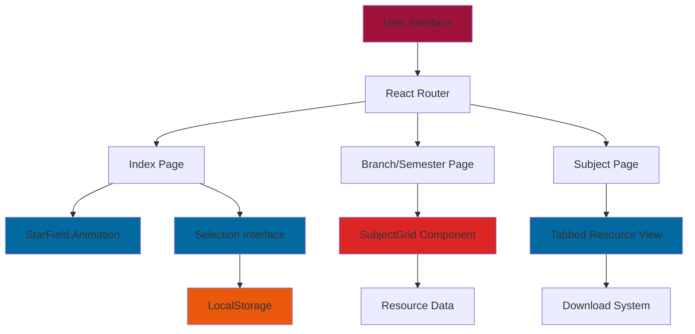

<h1 align="center">E N G R A M</h1>
<h3 align="center">The Centralized, No BS Open-Source Hub for IP University Study Materials</h3>

<p align="center">
  
  
  
</p>

## Project Overview

**ENGRAM** is a modern, open source web platform designed to centralize all study materials for IP University students across 8 engineering branches and semesters. 

ENGRAM is free and will **alyways stay free to access with no ads and no trackers**. It aims to provide instant access to notes, previous year questions, lab manuals, and comprehensive resources without the typical friction of academic resource hunting or unreliable websites.

This project emerged from my frustration of scattered study materials across different websites, whatsapp groups, drive links making exam preparation unnecessarily difficult for IPU students.

## Why This Project NEEDS You

### **This Isn't Just Another Study Platform**

> "ENGRAM isn't my project, or anyone else's individual project. This is **OUR** collective project - built by us, for us. Its success depends entirely on students like you helping to contribute and maintainin it."

**ENGRAM can only become THE definitive hub for IPU study materials if we all contribute to it.** Here's why your participation is crucial:

### **The Sustainability Challenge**

<table>
<tr>
<td align="center" width="33%">
<br><strong>Continuous Updates</strong><br>
<em>Syllabus changes, new subjects emerge, old materials become outdated. Without active maintenance, ENGRAM becomes just another dead repository.</em>
</td>
<td align="center" width="33%">
<br><strong>Content Quality</strong><br>
<em>The best notes come from students who just mastered the subject. Your fresh perspective and recently created materials are invaluable.</em>
</td>
<td align="center" width="33%">
<br><strong>Network Effects</strong><br>
<em>The more students contribute, the better ENGRAM becomes for everyone. We need critical mass to become the go-to resource.</em>
</td>
</tr>
</table>

### **The Vision for ENGRAM is**

- 🎯 **The First Stop** - Every IPU student's go-to resource for any subject

- 🏆 **Quality Guaranteed** - Peer-reviewed content that students trust

- 🚀 **Always Current** - Real-time updates as syllabi change

- 🤝 **Student-Led** - Decisions made by and for the community

<div align="center">

### **ENGRAM's Solution:**

<table>
<tr>
<td align="center" width="25%">
<br><strong>Centralized Hub</strong><br>
<em>Everything in one place</em>
</td>
<td align="center" width="25%">
<br><strong>Smart Organization</strong><br>
<em>Branch & semester based structure</em>
</td>
<td align="center" width="25%">
<br><strong>Instant Access</strong><br>
<em>No registration, no barriers</em>
</td>
<td align="center" width="25%">
<br><strong>Community Driven</strong><br>
<em>By students, for students</em>
</td>
</tr>
</table>

<div align="center">
<strong>💡 ENGRAM becomes powerful only when WE make it powerful together</strong>
</div>

## Key Features

<table>
<tr>
<td width="50%">

### 🎓 **Academic Coverage**
- **8 Engineering Branches** - AIDS, AIML, CIVIL, CSE, ECE, EEE, IT, MECH
- **8 Semester Range** - Complete undergraduate coverage
- **Comprehensive Resources** - Syllabus, Notes, PYQs, Lab materials, Books
- **Special Collections** - Akash notes and actually decent youtube lectures

</td>
<td width="50%">

### 🌌 **Cosmic User Experience**
- **Space-themed Interface** - Beautiful dark UI with starfield animations
- **Responsive Design** - Works perfectly on mobile, tablet, and desktop
- **Smart Navigation** - Remembers your branch/semester preferences
- **Instant Loading** - Fast, optimized React architecture

</td>
</tr>
<tr>
<td width="50%">

### 📚 **Resource Management**
- **Tabbed Organization** - Clean separation of different material types
- **Contributor Attribution** - Recognition for community contributors
- **Download & Preview** - Both options available for all materials
- **Search Integration** - Quick access to specific subjects

</td>
<td width="50%">

### 🛠️ **Technical Excellence**
- **Modern Stack** - React 18, TypeScript, Vite, Tailwind CSS
- **ShadCN UI** - Premium component library for consistency
- **Local Storage** - Persistent user preferences
- **PWA Ready** - Installable as a progressive web app

</td>
</tr>
</table>
</div>

## System Architecture



## 🚀 Getting Started

### Prerequisites

<table>
<tr>
<td width="50%">

**Development Requirements:**
- Node.js 18+ 
- npm or yarn or bun
- Modern web browser
- Git for version control

</td>
<td width="50%">

**System Requirements:**
- Any modern OS (Windows, macOS, Linux)
- 4GB+ RAM recommended
- 1GB+ free disk space
- Internet connection for setup

</td>
</tr>
</table>

### Quick Installation

```bash
# Clone the repository
git clone https://github.com/kuberwastaken/engram.git
cd engram

# Install dependencies (choose one)
npm install
# or
yarn install
# or
bun install

# Start development server
npm run dev
# or
yarn dev
# or
bun dev

# Open your browser to http://localhost:5173
```

## 📁 Project Structure

```
src/
├── components/               # Reusable UI components
│   ├── ui/                  # ShadCN UI primitive components
│   │   ├── card.tsx         # Card components
│   │   ├── button.tsx       # Button variants
│   │   ├── select.tsx       # Dropdown selectors
│   │   ├── tabs.tsx         # Tabbed interfaces
│   │   └── ...              # Other UI primitives
│   ├── StarField.tsx        # Animated cosmic background
│   └── SubjectGrid.tsx      # Subject cards grid layout
├── pages/                   # Application route pages
│   ├── Index.tsx            # Landing page with selection
│   ├── BranchSemester.tsx   # Subject listing page
│   ├── Subject.tsx          # Individual subject resources
│   └── NotFound.tsx         # 404 error page
├── hooks/                   # Custom React hooks
│   ├── use-toast.ts         # Toast notification system
│   └── use-mobile.tsx       # Mobile detection hook
├── lib/                     # Utility functions
│   └── utils.ts             # Helper functions and utilities
└── App.tsx                  # Main application component
```

## 💫 Design Philosophy

ENGRAM's interface draws inspiration from the vastness of space and the interconnected nature of knowledge:

### **Cosmic Visual Language**
- **Deep Space Backgrounds** - Gradients from deep black to cosmic blue
- **Starfield Animations** - Twinkling particles that create ambient movement
- **Nebula-inspired Cards** - Translucent containers with backdrop blur effects
- **Orbital Navigation** - Smooth transitions that feel like floating through space

### **Interaction Principles**
- **Gravity-defying Hovers** - Elements that gently lift and glow on interaction
- **Constellation Navigation** - Logical grouping of related elements
- **Stellar Performance** - Smooth 60fps animations throughout
- **Universal Accessibility** - Clear contrast and readable typography

## 📚 Adding Study Materials

### File Organization Structure

```
materials/
├── [BRANCH]/                # AIDS, AIML, CIVIL, CSE, ECE, EEE, IT, MECH
│   ├── [SEMESTER]/          # 1st, 2nd, 3rd, 4th, 5th, 6th
│   │   ├── [SUBJECT]/       # Subject name (spaces allowed)
│   │   │   ├── syllabus/    # Syllabus documents
│   │   │   ├── notes/       # Lecture notes and study materials
│   │   │   ├── pyqs/        # Previous year question papers
│   │   │   ├── lab/         # Lab manuals and code
│   │   │   ├── books/       # Reference books and textbooks
│   │   │   ├── akash/       # Special Akash collection
│   │   │   └── videos/      # Video lecture links
│   │   └── ...
│   └── ...
└── ...
```

### Naming Conventions

<table>
<tr>
<td width="50%">

**File Naming:**
- Use descriptive names: `Chapter_1_Introduction.pdf`
- Include year for PYQs: `PYQ_2023_EndSem.pdf`
- Use underscores instead of spaces: `Lab_Manual_v2.pdf`
- Include version numbers: `Notes_Complete_v3.pdf`

</td>
<td width="50%">

**Subject Naming:**
- Use official IPU subject names
- Maintain consistent capitalization
- Include subject codes when applicable: `CO101_Programming`
- Keep folder names clear and descriptive

</td>
</tr>
</table>

### Contribution Workflow

1. **Prepare Materials**
   - Organize files according to the structure above
   - Ensure files are properly named and categorized
   - Verify file quality and readability

2. **Update Resource Data**
   - Add entries to the appropriate data structures in `SubjectGrid.tsx`
   - Include contributor attribution for recognition
   - Update subject listings if adding new subjects

3. **Test Integration**
   - Run the development server locally
   - Navigate to your additions and test download/preview
   - Ensure proper routing and file access

4. **Submit Contribution**
   - Create a pull request with clear description
   - Include screenshots of the additions
   - Mention the scope of materials added

## 🎯 Usage Guide

### For Students

1. **🎓 Select Your Academic Path**
   - Choose your engineering branch from the dropdown
   - Pick your current semester
   - Your preferences are automatically saved for future visits

2. **📖 Browse Available Subjects**
   - View all subjects for your branch/semester combination
   - Each subject card shows available resource types
   - Click on any subject to dive deeper

3. **📚 Access Study Materials**
   - Use the tabbed interface to navigate different resource types:
     - **SYLLABUS** - Complete course outline and assessment pattern
     - **NOTES** - Comprehensive lecture notes and study guides
     - **PYQS** - Previous year question papers with solutions
     - **LAB** - Lab manuals, experiments, and code samples
     - **BOOKS** - Reference books and additional reading material
     - **AKASH** - Special curated notes collection
     - **VIDEOS** - Video lectures and tutorials

4. **⬇️ Download & Study**
   - Download materials instantly with one click or just view it
   - Preview documents before downloading (when available)
   - All resources are free and require no registration

### For Contributors

1. **📤 Adding New Materials**
   - Organize files according to the structure guidelines
   - Follow naming conventions for consistency
   - Include proper attribution and metadata

2. **🔧 Technical Contributions**
   - Fork the repository and create feature branches
   - Follow the existing code style and patterns
   - Test thoroughly before submitting pull requests

3. **🐛 Reporting Issues**
   - Use GitHub Issues for bug reports and feature requests
   - Provide detailed descriptions and reproduction steps
   - Include screenshots for UI-related issues

## 🌟 Contributing

**This is not just an open-source project - it's OUR collective responsibility to build and maintain the study hub that IPU desperately needs.**

### **Every Contribution Matters**

ENGRAM's success isn't measured by GitHub stars or code quality alone - it's measured by how many IPU students can access quality study materials when they need them most. **Your contribution, no matter how small, directly impacts thousands of students.**

### **The Collective Ownership Model**

ENGRAM operates on a simple principle: **Everyone benefits, everyone contributes.**


**This isn't charity work - it's enlightened self-interest:**
- 📈 **Better materials help YOU study more effectively**
- 🤝 **Your contributions get recognized and credited**
- 🎯 **You shape the platform to work exactly how you need it**
- 💪 **You build skills in collaboration and project management**

We welcome contributions from the IPU community and beyond! Here's how you can help make ENGRAM even better:

<table>
<tr>
<td width="50%">

### **📚 Content Contributions**
- **Add Study Materials** - Share your notes, PYQs, lab files
- **Update Resources** - Keep materials current with latest syllabus
- **Quality Review** - Help verify and improve existing content
- **Organize Content** - Better categorization and tagging

</td>
<td width="50%">

### **💻 Code Contributions**
- **Feature Development** - New functionality and improvements
- **Bug Fixes** - Resolve issues and enhance stability
- **UI/UX Enhancements** - Better design and user experience
- **Performance Optimization** - Faster loading and smoother animations

</td>
</tr>
<tr>
<td width="50%">

### **🎨 Design Contributions**
- **Visual Assets** - Icons, illustrations, branding elements
- **Animation Improvements** - Enhanced cosmic effects
- **Mobile Experience** - Better responsive design
- **Accessibility** - Improved support for all users

</td>
<td width="50%">

### **📖 Documentation**
- **Usage Guides** - Help new users get started
- **Technical Documentation** - Code explanations and architecture
- **Contribution Guidelines** - Clear processes for contributors
- **Video Tutorials** - Visual guides for common tasks

</td>
</tr>
</table>

### **Making ENGRAM Truly Ours**

**Current Status:** 🌱 **Pre Alpha** - We have the foundation, now we need the community

**What Success Looks Like:**
- 🎯 **90%+ Coverage** - Every IPU subject has quality materials
- 🏆 **Student Recognition** - Top contributors become campus legends
- 📱 **Platform Evolution** - Features requested and built by students
- 🌍 **Beyond IPU** - Model adopted by other universities

**Your Role in This Journey:**
1. **Immediate Impact** - Add materials you have right now
2. **Ongoing Commitment** - Update resources as you create new ones
3. **Community Building** - Encourage classmates to contribute
4. **Quality Assurance** - Review and improve existing materials
5. **Feature Requests** - Help shape the platform's future

<div align="center">

**🚀 The goal isn't just to build a study platform - it's to create a sustainable ecosystem where knowledge flows freely between IPU students across generations.**

</div>

## 🔗 References & Inspiration

<table>
<tr>
<td width="50%">

### **Educational Platforms**
- [Khan Academy](https://www.khanacademy.org/) - Educational content organization
- [MIT OpenCourseWare](https://ocw.mit.edu/) - Open educational resources
- [Coursera](https://www.coursera.org/) - Course structure and navigation
- [edX](https://www.edx.org/) - Academic material presentation

</td>
<td width="50%">

### **Technical Resources**
- [ShadCN UI](https://ui.shadcn.com/) - Component library foundation
- [Tailwind CSS](https://tailwindcss.com/) - Utility-first styling approach
- [React Router](https://reactrouter.com/) - Client-side routing patterns
- [Vite](https://vitejs.dev/) - Build tool and development server

</td>
</tr>
<tr>
<td width="50%">

### **Design Inspiration**
- [Linear](https://linear.app/) - Clean, modern interface design
- [Vercel](https://vercel.com/) - Dark theme and space aesthetics
- [GitHub](https://github.com/) - Code organization and presentation
- [Notion](https://www.notion.so/) - Content organization patterns

</td>
<td width="50%">

### **Community Projects**
- [FreeCodeCamp](https://www.freecodecamp.org/) - Open source education
- [The Odin Project](https://www.theodinproject.com/) - Community-driven learning
- [MDN Web Docs](https://developer.mozilla.org/) - Comprehensive documentation
- [Stack Overflow](https://stackoverflow.com/) - Community knowledge sharing

</td>
</tr>
</table>

## 📜 License

This project is licensed under the **Apache 2.0 License** - see the [LICENSE](LICENSE) file for details.

---

<div align="center">

### 🌟 **Star this repository if you find it helpful!**

**Built with ❤️ by [Kuber Mehta](https://kuber.studio/) and the entire IPU student community**

</div>
