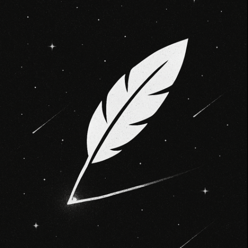

<div align="center">
   
</div>

<h1 align="center">E N G R A M</h1>
<h3 align="center">The Centralized, No BS Open-Source Hub for IP University Study Materials</h3>

<p align="center">
   
   
   
</p>

<div align="center">
   <table>
       <td align="center" width="60%">
         
         <br><em>Desktop Experience</em>
       </td>
       <td align="center" width="40%">
         
         <br><em>Mobile Experience</em>
         </td>
      </tr>
   </table>
</div>

## Project Overview

**ENGRAM** is a modern, open-source web platform designed to centralize all study materials for IP University students across 8 engineering branches and semesters. 

### IT IS NOT A NOTES PLATFORM, IT IS AN AGGREGATOR.

ENGRAM is and will **always stay free to access with no ads and no trackers**. It aims to provide instant access to notes, previous year questions, lab manuals, and comprehensive resources without the typical friction of academic resource hunting or unreliable websites.

**Born from Frustration, Built for (potential) Solutions**

> *"I don't know about you, but during exam prep, I don't like having to open 4 different websites, 2 drive links and 4 WhatsApp groups just to get good material. Sometimes the websites are down, have bad UI and are filled with ads, half the notes are outdated or just confusing. This was me literally two days before our last exam and I honestly had it. That's why I started making ENGRAM."*

## Project Overview

This is... a very large scale project

large scale enough that most others that've undertook it just give up due to the sheer volume.

To not go down the same path, this is Open Source

Some stuff we've proudly achieved

- ✅ **Aggregated Content** - Notes from Dotnotes, SyllabusX, Bunk to Brains and Fifteenfourteen (with proper credits and attributions)
- ✅ **Clean Interface** - Modern, space-themed UI with no ads or trackers
- ✅ **Smart Organization** - Branch and semester-based structure
- ✅ **Google Drive Integration** - Currently using JSON metadata with Google Drive links for 15,000+ materials

### **What's Coming Next**

- 🚧 **Community Upload System** - Easy pull request workflow for material contributions
- 🚧 **Real-time Updates** - Always current materials with community maintenance
- 🚧 **Contributor Recognition** - Your name on every note you upload (with potential backlinks)


<td align="center" width="33%">
<br><strong>Scattered Resources</strong><br>
<em>Most notes on present sites are old, new assignments don't get uploaded, and you REALLY have to dig to find quality material.</em>
</td>
<td align="center" width="33%">
<br><strong>Outdated Content</strong><br>
<em>Old notes, old papers, outdated assignments. Without active maintenance, platforms become digital graveyards.</em>
</td>
<td align="center" width="33%">
<br><strong>Poor User Experience</strong><br>
<em>Bad UI, ads everywhere, unreliable websites that go down during exam time when you need them most.</em>
</td>
</tr>
</table>

### **The Sustainability Challenge**

<table>
<tr>
<td align="center" width="33%">
<br><strong>Continuous Updates</strong><br>
<em>Syllabus changes, new subjects emerge, old materials become outdated. Without active maintenance, ENGRAM becomes just another dead repository.</em>
</td>
<td align="center" width="33%">
<br><strong>Content Quality</strong><br>
<em>The best notes come from students who just mastered the subject. Your fresh perspective and recently created materials are invaluable.</em>
</td>
<td align="center" width="33%">
<br><strong>Network Effects</strong><br>
<em>The more students contribute, the better ENGRAM becomes for everyone. We need critical mass to become the go-to resource.</em>
</td>
</tr>
</table>

### **Why even work on this if it's so complicated**

> *"I want us to create a resource that out-lives us even after graduation, constantly evolves and is a token from us to our future juniors. Simple."*

<div align="center">

## Technical Architecture & Implementation

### **Current Technology Stack**
- **Frontend:** React 18 + TypeScript + Vite
- **Styling:** Tailwind CSS + ShadCN UI components
- **Routing:** React Router for seamless navigation
- **State:** Local Storage for user preferences
- **Content:** JSON metadata with Google Drive integration
- **Deployment:** GitHub Pages with custom domain

## 🚀 Getting Started

### Prerequisites

<table>
<tr>
<td width="50%">

**Development Requirements:**
- Node.js 18+ or Bun (recommended)
- npm, yarn, or bun package manager
- Modern web browser (Chrome, Firefox, Safari, Edge)
- Git for version control

</td>
<td width="50%">

**System Requirements:**
- Any modern OS (Windows, macOS, Linux)
- 4GB+ RAM recommended
- 1GB+ free disk space
- Stable internet connection

</td>
</tr>
</table>

### Quick Installation

```bash
# Clone the repository
git clone https://github.com/kuberwastaken/engram
cd engram

# Install dependencies (choose one)
npm install
# or
yarn install
# or (recommended)
bun install

# Start development server
npm run dev
# or
yarn dev
# or (recommended)
bun dev

# Open your browser to http://localhost:8080
```

## 📚 Current Content & Sources

### **Aggregated Content Sources**
ENGRAM currently aggregates materials from multiple trusted sources, with proper attribution - this might be stingy but most websites aren't maintained because there's no monetary gains from having websites like these

except if you have adblock, which just ruins the entire experience.

We've made sure to properly attribute EVERY note gathered in Engram

## How to Contribute Materials

Coming soon! If you have a large repository or volume of content, DM me.

## 🌟 Contributing

**This is not just an open-source project - it's OUR collective responsibility to build and maintain the study hub that IPU desperately needs.**

<div align="center">

**🌟 The goal isn't just to build a study platform - it's to create a sustainable ecosystem where knowledge flows freely between IPU students across generations.**

**This affects ALL of us. Let's make it happen together.**

</div>

## 🔗 References & Inspiration

<table>
<tr>
<td width="50%">

### **Educational Platforms**
- [Khan Academy](https://www.khanacademy.org/) - Educational content organization
- [MIT OpenCourseWare](https://ocw.mit.edu/) - Open educational resources
- [Coursera](https://www.coursera.org/) - Course structure and navigation
- [edX](https://www.edx.org/) - Academic material presentation

</td>
<td width="50%">

### **Technical Resources**
- [ShadCN UI](https://ui.shadcn.com/) - Component library foundation
- [Tailwind CSS](https://tailwindcss.com/) - Utility-first styling approach
- [React Router](https://reactrouter.com/) - Client-side routing patterns
- [Vite](https://vitejs.dev/) - Build tool and development server

</td>
</tr>
<tr>
<td width="50%">

### **Design Inspiration**
- [Linear](https://linear.app/) - Clean, modern interface design
- [Vercel](https://vercel.com/) - Dark theme and space aesthetics
- [GitHub](https://github.com/) - Code organization and presentation
- [Notion](https://www.notion.so/) - Content organization patterns

</td>
<td width="50%">

### **Community Projects**
- [FreeCodeCamp](https://www.freecodecamp.org/) - Open source education
- [The Odin Project](https://www.theodinproject.com/) - Community-driven learning
- [MDN Web Docs](https://developer.mozilla.org/) - Comprehensive documentation
- [Stack Overflow](https://stackoverflow.com/) - Community knowledge sharing

</td>
</tr>
</table>

## 📜 License

This project is licensed under the **Apache 2.0 License** - see the [LICENSE](LICENSE) file for details.

---

<div align="center">

### 🌟 **Star this repository if you find it helpful!**

### 📢 **Share with your IPU friends and communities**

**Built with ❤️ by [Kuber Mehta](https://x.com/Kuberwastaken) and the entire IPU student community**

</div>
